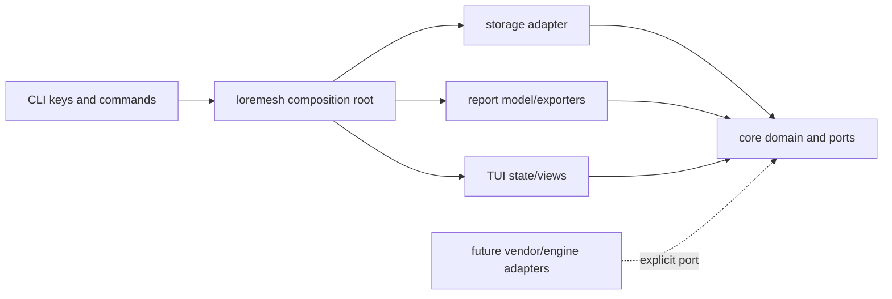
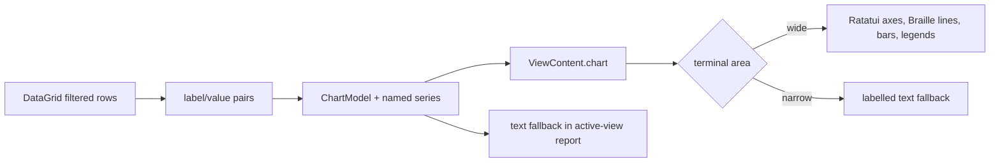

# Code structure and rendering boundaries

This document is the shortest path for reviewing where code belongs and how structured data reaches the terminal or an export. It describes the current implementation, including known foundation compromises; it is not a catalogue of hypothetical subsystems.

## Review map

| Path | Review responsibility | Primary boundary to verify |
|---|---|---|
| `crates/loremesh-core/src/lib.rs` | Canonical knowledge, evidence, feedback, trace types, identifiers, and invariants | No UI, SQL, filesystem, process, network, or vendor dependency |
| `crates/loremesh-storage/src/lib.rs` | Workspace layout, immutable objects, SQLite schema, repositories | Implements persistence without owning presentation rules |
| `crates/loremesh-report/src/lib.rs` | `Report`, `ReportSection`, `ReportBlock`, `TableModel`, `Metric`, and deterministic exporters | Reads no terminal or storage state; performs no I/O or network access |
| `crates/loremesh-tui/src/lib.rs` | `ViewContent`, `ViewTable`, dashboard projection, shell state, input handling, and responsive Ratatui table/chart widgets | Filesystem and processes enter only through `CommandHandler` |
| `crates/loremesh-tui/src/grid.rs` | Interactive CSV table state: search, filter, sort, visible columns, and projection | Produces `ViewTable`; it is not a canonical report or domain model |
| `crates/loremesh-tui/src/chart.rs` | Multi-series `ChartModel`, numeric/category validation, and deterministic compact text fallback | Does not read files or know Ratatui; graphical exporters are not implemented |
| `crates/loremesh-tui/src/theme.rs` | Semantic color roles and stable chart-series palette | Contains no feature or domain decisions |
| `crates/loremesh-tui/src/browser.rs` | Safe code view model, numbering, search, terminal neutralization | Receives bytes from the application; does not open paths itself |
| `crates/loremesh-tui/src/markdown.rs` | Parsed Markdown presentation and textual Mermaid/D2 preview | Does not execute diagrams, HTML, scripts, or remote assets |
| `crates/loremesh/src/main.rs` | CLI and composition root; domain-to-report construction; `ViewContent` to `Report` conversion; safe export writes | Concrete adapters and cross-crate conversions stay here |
| `crates/loremesh/src/workbench.rs` | Workspace-safe file commands, table/chart orchestration, PTY lifecycle, and application responses | Untrusted I/O is bounded and converted before entering presentation state |
| `crates/loremesh-core/src/corpus.rs` | Vendor-neutral corpus manifest wire model | Contains no path access, downloader, or vendor-specific fields |
| `crates/loremesh-core/src/index.rs` | Lexical index port and canonical-ID search projections | Contains no Tantivy, filesystem, SQL, or presentation types |
| `crates/loremesh-core/src/relationship.rs` | Canonical relationships, pinned code references, and provider provenance | External IDs remain metadata and never become feedback targets |
| `crates/loremesh-storage/src/corpus.rs` | Safe manifest import, immutable snapshot lifecycle, health diagnostics, relationship persistence | Performs no network access or content execution |
| `crates/loremesh-storage/src/lexical.rs` | Disposable Tantivy knowledge-index adapter | Cannot delete or rewrite canonical database/object records |
| `tools/public-corpus-builder` | Explicit pinned public fetch and generic transformation | Never runs in normal CI; Kubernetes knowledge stays outside core |
| `tools/corpus-generator` | Deterministic synthetic scale data | Writes only requested new output and requires acknowledgement for large sizes |

## Dependency boundary

The crate graph points inward. A lower row may not import a higher row merely to reuse a convenient type.



Review rule: domain policy moves toward `loremesh-core`; terminal-specific projection moves toward `loremesh-tui`; concrete I/O and conversions remain in `loremesh`. Sharing a shape is not by itself a reason to collapse two models with different invariants.

## Table boundaries

There are three table models because they serve different lifetimes and invariants.

| Type | Owner | Purpose | Mutable? | Persisted/public format? |
|---|---|---|---|---|
| `TableModel` | `loremesh-report` | Canonical rectangular block for deterministic exports | No | Serialized inside the pre-stable report format |
| `DataGrid` | `loremesh-tui::grid` | Interactive loaded CSV plus search/filter/sort/visible-column state | Yes | No |
| `ViewTable` | `loremesh-tui` | Display-ready columns and rows for the active terminal view | No | No |

`DataGrid::projection()` is the only grid-to-terminal conversion. `report_from_view()` in the binary explicitly validates a `ViewTable` into a report `TableModel` before saving the active view. Workspace reports are built directly as `TableModel` values from repository results. This prevents terminal selection, filters, or widget state from leaking silently into canonical exports.

```d2
direction: right

csv-file -> bounded-read: application I/O
bounded-read -> data-grid: "parse + validate"

data-grid -> data-grid: "search / filter / sort / columns"
data-grid -> view-table: projection
view-table -> ratatui-table: "terminal render"

data-grid -> csv-export: "projection_csv()"
view-table -> table-model: "report_from_view() + validate"
table-model -> report-renderers: "JSON / CSV / Markdown / HTML"

classes: {
  io: { style.fill: "#fee2e2" }
  state: { style.fill: "#dbeafe" }
  projection: { style.fill: "#dcfce7" }
}
csv-file.class: io
bounded-read.class: io
data-grid.class: state
view-table.class: projection
table-model.class: projection
csv-export.class: io
report-renderers.class: io
```

The two CSV paths are intentionally different. `/table save` writes the current interactive grid projection with spreadsheet-formula neutralization. Report CSV exports the first canonical report table. A future unification must preserve both observable contracts.

## Chart and renderer boundaries

The current chart path keeps data separate from terminal widgets:

1. `DataGrid::value_pairs()` selects labelled values from the filtered rows.
2. `ChartModel::from_pairs()` creates one named series; `with_series()` validates explicit multi-series data.
3. The application places the structured `ChartModel` in `ViewContent.chart`.
4. The TUI chooses a responsive Ratatui line, vertical-bar, horizontal-bar, or proportional-distribution renderer.
5. `ChartModel::render_text()` remains the deterministic narrow-terminal and export fallback.

`ChartModel` stores no Ratatui types or colors. Semantic roles and the stable six-color series palette live in `theme.rs`; labels, values, shapes, and legends retain meaning when color is unavailable. Table and chart views receive the full body width, while ordinary narrative views retain the timeline/context split.

| Theme role | Default | Used for |
|---|---|---|
| `primary` | Cyan | Product identity, headers, first chart series |
| `secondary` | Magenta | Disputed/inferred states, second chart series |
| `success` | Green | Passed, connected, verified, successful states |
| `warning` | Yellow | Waiting, warning, stale, degraded states and active input |
| `danger` | Red | Critical, failed, rejected, error, disconnected states |
| `muted` | Dark gray | Inactive borders, unreviewed/unknown/disabled states, hints |
| `text` | Gray | Ordinary values and body text |
| `focus` | Light cyan + bold | Keyboard-focused region border |

Status matching is case-insensitive and conservative: unknown values remain ordinary text. Color supplements the visible word, chart shape, numeric value, or border weight; it never replaces them.



| Renderer | Input | Owner now | Boundary |
|---|---|---|---|
| Ratatui table | `ViewTable` | `loremesh-tui::draw_timeline` | Terminal only; no export logic |
| Ratatui text/detail | `ViewContent` | `loremesh-tui` | Terminal only; no filesystem access |
| Responsive terminal charts | `ChartModel` | `loremesh-tui` | Ratatui widgets, semantic theme, no I/O |
| Compact chart text | `ChartModel` | `loremesh-tui::chart` | Deterministic fallback; no Ratatui dependency |
| Report JSON/CSV/Markdown/HTML | `Report` | `loremesh-report` | Pure serialization; no writes |
| Mermaid/D2 Markdown save | `ViewContent` plus validated `Report` | composition root using `loremesh-report` | Preserves diagram source; does not execute a renderer |
| PNG | Not implemented | Future explicit local adapter | Must be opt-in, bounded, and documented before use |

## Conversion and I/O rules

- Model constructors validate at every boundary; conversions must not construct invalid public structs silently.
- Renderers return strings or bytes. The composition root chooses safe workspace-relative paths and performs atomic or no-overwrite writes.
- Imported CSV, Markdown, code, shell output, and diagram source are untrusted.
- Terminal control sequences are neutralized before textual display. HTML exporters escape untrusted values.
- A renderer may not read source files, query SQLite, start a subprocess, access the network, or mutate domain state.
- A presentation model may be discarded and rebuilt without changing authoritative source snapshots or canonical findings.

## Known review risks

- `ViewTable` and report `TableModel` duplicate a rectangular shape. This is intentional today, but every conversion needs invariant tests.
- `ChartModel::render_text()` remains beside chart data because it is the compact/export fallback. Move it behind a renderer interface only when another non-terminal renderer creates a useful boundary.
- Active-view diagram saving is composed in the binary rather than `loremesh-report` because Mermaid/D2 are optional presentation source on `ViewContent`, not report blocks yet.
- Large-table virtualization, runtime/user themes, multiple report-table CSV export, graphical chart export, and a sanitized SVG pipeline are deferred and must not be implied by current interfaces.
