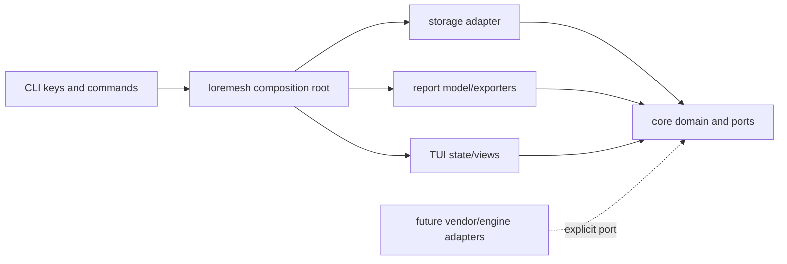

# Code structure and rendering boundaries

This document is the shortest path for reviewing where code belongs and how structured data reaches the terminal or an export. It describes the current implementation, including known foundation compromises; it is not a catalogue of hypothetical subsystems.

## Review map

| Path | Review responsibility | Primary boundary to verify |
|---|---|---|
| `crates/loremesh-core/src/lib.rs` | Canonical knowledge, evidence, feedback, trace types, identifiers, and invariants | No UI, SQL, filesystem, process, network, or vendor dependency |
| `crates/loremesh-storage/src/lib.rs` | Workspace layout, immutable objects, SQLite schema, repositories | Implements persistence without owning presentation rules |
| `crates/loremesh-report/src/lib.rs` | `Report`, `ReportSection`, `ReportBlock`, `TableModel`, `Metric`, and deterministic exporters | Reads no terminal or storage state; performs no I/O or network access |
| `crates/loremesh-tui/src/lib.rs` | `ViewContent`, `ViewTable`, dashboard projection, shell state, input handling, and Ratatui widgets | Filesystem and processes enter only through `CommandHandler` |
| `crates/loremesh-tui/src/grid.rs` | Interactive CSV table state: search, filter, sort, visible columns, and projection | Produces `ViewTable`; it is not a canonical report or domain model |
| `crates/loremesh-tui/src/chart.rs` | `ChartModel`, numeric validation, and deterministic terminal text rendering | Does not read files or know Ratatui; graphical exporters are not implemented |
| `crates/loremesh-tui/src/browser.rs` | Safe code view model, numbering, search, terminal neutralization | Receives bytes from the application; does not open paths itself |
| `crates/loremesh-tui/src/markdown.rs` | Parsed Markdown presentation and textual Mermaid/D2 preview | Does not execute diagrams, HTML, scripts, or remote assets |
| `crates/loremesh/src/main.rs` | CLI and composition root; domain-to-report construction; `ViewContent` to `Report` conversion; safe export writes | Concrete adapters and cross-crate conversions stay here |
| `crates/loremesh/src/workbench.rs` | Workspace-safe file commands, table/chart orchestration, PTY lifecycle, and application responses | Untrusted I/O is bounded and converted before entering presentation state |

## Dependency boundary

The crate graph points inward. A lower row may not import a higher row merely to reuse a convenient type.



Review rule: domain policy moves toward `loremesh-core`; terminal-specific projection moves toward `loremesh-tui`; concrete I/O and conversions remain in `loremesh`. Sharing a shape is not by itself a reason to collapse two models with different invariants.

## Table boundaries

There are three table models because they serve different lifetimes and invariants.

| Type | Owner | Purpose | Mutable? | Persisted/public format? |
|---|---|---|---|---|
| `TableModel` | `loremesh-report` | Canonical rectangular block for deterministic exports | No | Serialized inside the pre-stable report format |
| `DataGrid` | `loremesh-tui::grid` | Interactive loaded CSV plus search/filter/sort/visible-column state | Yes | No |
| `ViewTable` | `loremesh-tui` | Display-ready columns and rows for the active terminal view | No | No |

`DataGrid::projection()` is the only grid-to-terminal conversion. `report_from_view()` in the binary explicitly validates a `ViewTable` into a report `TableModel` before saving the active view. Workspace reports are built directly as `TableModel` values from repository results. This prevents terminal selection, filters, or widget state from leaking silently into canonical exports.

```d2
direction: right

csv-file -> bounded-read: application I/O
bounded-read -> data-grid: "parse + validate"

data-grid -> data-grid: "search / filter / sort / columns"
data-grid -> view-table: projection
view-table -> ratatui-table: "terminal render"

data-grid -> csv-export: "projection_csv()"
view-table -> table-model: "report_from_view() + validate"
table-model -> report-renderers: "JSON / CSV / Markdown / HTML"

classes: {
  io: { style.fill: "#fee2e2" }
  state: { style.fill: "#dbeafe" }
  projection: { style.fill: "#dcfce7" }
}
csv-file.class: io
bounded-read.class: io
data-grid.class: state
view-table.class: projection
table-model.class: projection
csv-export.class: io
report-renderers.class: io
```

The two CSV paths are intentionally different. `/table save` writes the current interactive grid projection with spreadsheet-formula neutralization. Report CSV exports the first canonical report table. A future unification must preserve both observable contracts.

## Chart and renderer boundaries

The current chart path is deliberately small:

1. `DataGrid::value_pairs()` selects labelled values from the filtered rows.
2. `ChartModel::from_pairs()` parses finite numbers and validates labels.
3. `ChartModel::render_text()` produces deterministic Unicode text.
4. The application places that text in `ViewContent.paragraphs`.
5. Ratatui renders the paragraph without knowing chart semantics.

`ChartModel` is renderer-neutral data, but `render_text()` currently lives beside it in `chart.rs`. That is an acceptable foundation-sized module, not permission to add PNG, SVG, HTML, or Ratatui-specific rendering there. When a second chart renderer is implemented, split pure chart data from renderer implementations within `loremesh-tui` or a justified report/presentation crate; do not move charts into `loremesh-core` unless they become canonical knowledge.

| Renderer | Input | Owner now | Boundary |
|---|---|---|---|
| Ratatui table | `ViewTable` | `loremesh-tui::draw_timeline` | Terminal only; no export logic |
| Ratatui text/detail | `ViewContent` | `loremesh-tui` | Terminal only; no filesystem access |
| Terminal chart text | `ChartModel` | `loremesh-tui::chart` | Deterministic text; no Ratatui dependency |
| Report JSON/CSV/Markdown/HTML | `Report` | `loremesh-report` | Pure serialization; no writes |
| Mermaid/D2 Markdown save | `ViewContent` plus validated `Report` | composition root using `loremesh-report` | Preserves diagram source; does not execute a renderer |
| PNG | Not implemented | Future explicit local adapter | Must be opt-in, bounded, and documented before use |

## Conversion and I/O rules

- Model constructors validate at every boundary; conversions must not construct invalid public structs silently.
- Renderers return strings or bytes. The composition root chooses safe workspace-relative paths and performs atomic or no-overwrite writes.
- Imported CSV, Markdown, code, shell output, and diagram source are untrusted.
- Terminal control sequences are neutralized before textual display. HTML exporters escape untrusted values.
- A renderer may not read source files, query SQLite, start a subprocess, access the network, or mutate domain state.
- A presentation model may be discarded and rebuilt without changing authoritative source snapshots or canonical findings.

## Known review risks

- `ViewTable` and report `TableModel` duplicate a rectangular shape. This is intentional today, but every conversion needs invariant tests.
- `ChartModel::render_text()` combines chart data and one renderer in a single module. Split it when a second renderer creates a real boundary.
- Active-view diagram saving is composed in the binary rather than `loremesh-report` because Mermaid/D2 are optional presentation source on `ViewContent`, not report blocks yet.
- Large-table virtualization, multiple report-table CSV export, graphical chart rendering, and a sanitized SVG pipeline are deferred and must not be implied by current interfaces.
