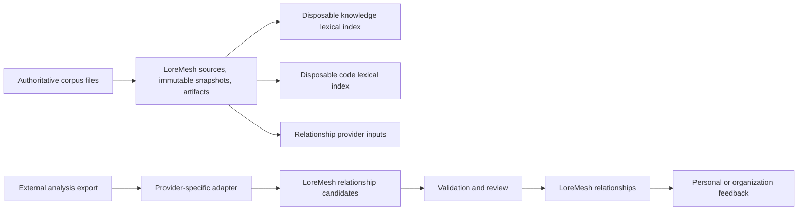

# Corpus and indexing architecture

The authoritative path and disposable capabilities are deliberately asymmetric:



Deleting `lexical`, `code`, provider output, embeddings, summaries, or caches cannot delete the canonical branch. A relationship accepted into LoreMesh has its own stable ID, generic origin, verification state, optional evidence, and external provenance. Feedback targets that LoreMesh ID. Re-running or replacing an engine can create, match, supersede, or reject candidates but cannot erase historical feedback.

The knowledge index consumes Markdown knowledge documents, including code specifications. The future code index consumes actual repository files identified by repository identity, pinned revision, path, symbol, and optional line range. A bare mutable line number is never durable evidence. Tree-sitter may later add a disposable structural code index; it is not part of this slice.

```d2
direction: right

corpus-files -> source
source -> immutable-snapshot
immutable-snapshot -> artifact
artifact -> evidence
evidence -> finding

artifact -> tantivy-index: "rebuildable projection" {
  style.stroke-dash: 4
}
artifact -> future-code-index: "actual code only" {
  style.stroke-dash: 4
}
external-engine -> relationship-candidate: adapter
relationship-candidate -> loremesh-relationship: validate
loremesh-relationship -> feedback: "stable target"
```

Tantivy lives in `loremesh-storage` as the first `LexicalIndex` adapter. The core port contains no Tantivy types. SQLite remains operational/canonical metadata storage, not the full-text representation. Index state lives below `.loremesh/indexes`; object bytes remain below `.loremesh/objects`.

Corpus import is synchronous and bounded in this foundation. Large-corpus streaming, concurrency, background rebuilds, and resource telemetry require measured need and explicit limits before introduction.

A future provider implements a synchronous, vendor-neutral boundary shaped like `analyze(RelationshipAnalysisInput) -> Result<Vec<RelationshipCandidate>, RelationshipProviderError>` and declares a stable provider name. Subprocess, timeout, protocol, and cancellation behavior stays in the adapter/composition layer described by ADR 0005; it is not encoded into the relationship entity. An eventual Graphify importer therefore translates exports to candidates, and feedback continues to target accepted LoreMesh relationship IDs.
