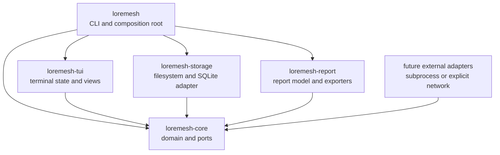

# Architecture overview

LoreMesh is a Rust modular monolith using ports and adapters. Arrows show allowed compile-time dependency direction, not runtime data flow.

`loremesh-core` owns invariants and abstractions. `loremesh-storage` implements local persistence. `loremesh-report` transforms domain state into renderer-independent reports and serializes them. `loremesh-tui` maps state into testable view models and Ratatui widgets. The `loremesh` binary parses commands and wires concrete implementations.

Sources and immutable snapshots are authoritative source records. Artifacts, evidence, findings, accepted relationships, traces, and feedback are canonical LoreMesh knowledge or human records with explicit lifecycle rules. SQLite is their current replaceable persistence adapter; indexes, provider outputs, presentation tables, and rendered files are derived. Constructors make dependencies explicit; there is no global service locator.

Accepted LoreMesh relationships and human feedback are canonical review records; external engine candidates and lexical/code indexes are disposable projections. See [Corpus and indexing architecture](indexing.md).

For a file-by-file review map and the table/chart/rendering boundaries, see [Code structure and rendering boundaries](code-structure-and-rendering.md).
